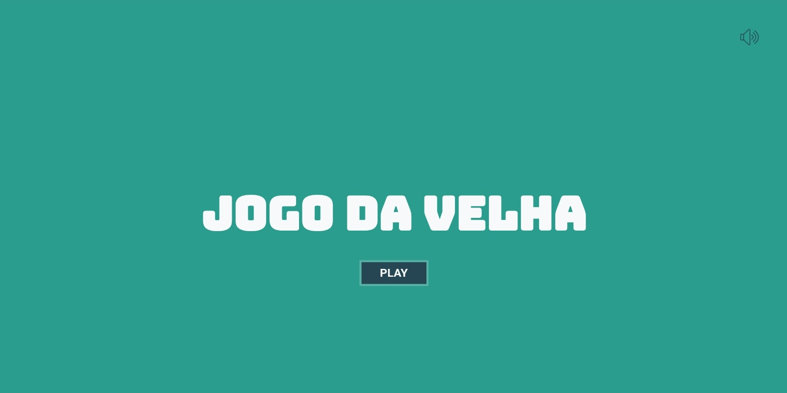
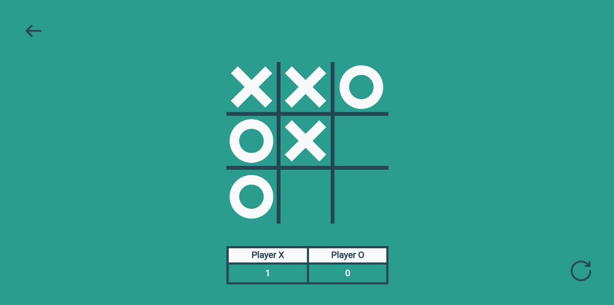

<h1>👵🏻🕹 Jogo da Velha</h1>
  
Neste projeto de desenvolvimento front-end, o objetivo principal foi criar uma versão do clássico <b>Jogo da Velha</b>.  
    Ele surgiu como parte de um desafio pessoal, visando aprimorar habilidades de lógica de programação  
    e aplicar conceitos fundamentais de JavaScript na prática.  
    Além de ser uma oportunidade para consolidar conhecimentos em desenvolvimento web, este projeto proporciona uma experiência 
    valiosa para entender como implementar um jogo tradicional utilizando tecnologias modernas da web. 
     
     
    Sinta-se à vontade para explorar e desfrutar desta implementação do <a href="https://valdezjulian-jogo-da-velha.vercel.app/">Jogo da Velha</a> e divirta-se jogando!

     
<h2>Funcionalidades</h2>
  
• Interface Amigável: O jogo apresenta uma interface intuitiva para facilitar a experiência do usuário.
     
    • Jogabilidade: Permite jogar contra um oponente humano ou contra um bot.
     
    • Padrão MVC: Utiliza o padrão Model-View-Controller para separar a lógica de negócio da interface do usuário. 
    O arquivo interface.js atua como controlador, intermediando a interação entre a lógica do jogo e a interface gráfica.

 
<h3>Tecnologias Utilizadas:</h3>
   
  
  
 
<h4>Como Jogar</h4>
  
Para iniciar uma partida de Jogo da Velha, siga estas instruções simples:
   
  <b>1.</b> Abra o arquivo index.html em um navegador web compatível.
   
  <b>2.</b> Escolha se deseja jogar contra um amigo ou contra o bot.
   
  <b>3.</b> Clique nas células para fazer suas jogadas.
   
  <b>4.</b> O jogo continuará até que alguém vença ou ocorra um empate.

   

<b>• Preview do projeto</b>

  
- Mockup

    
 
  
- Página inical

  
 
  
- Página Game

   
  

